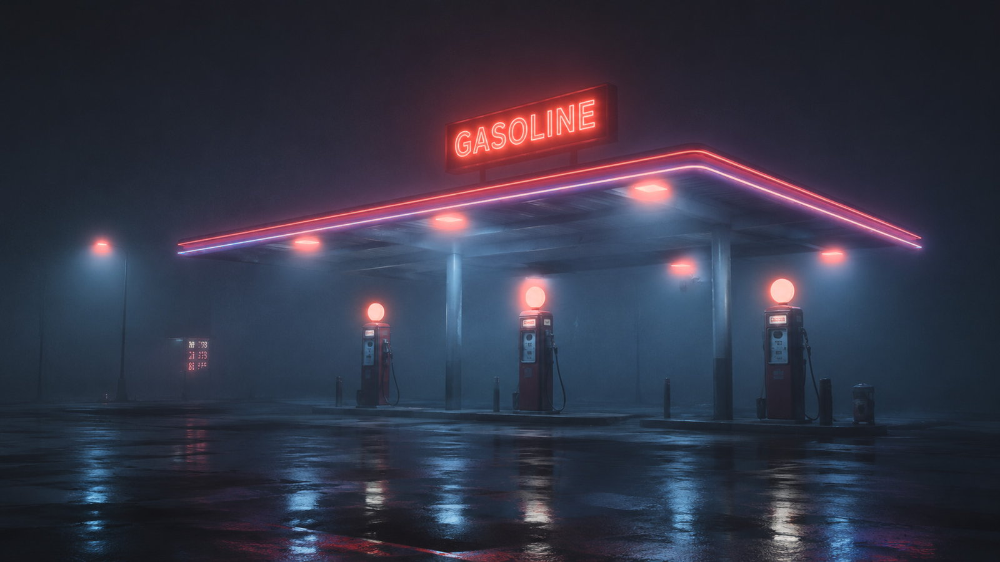
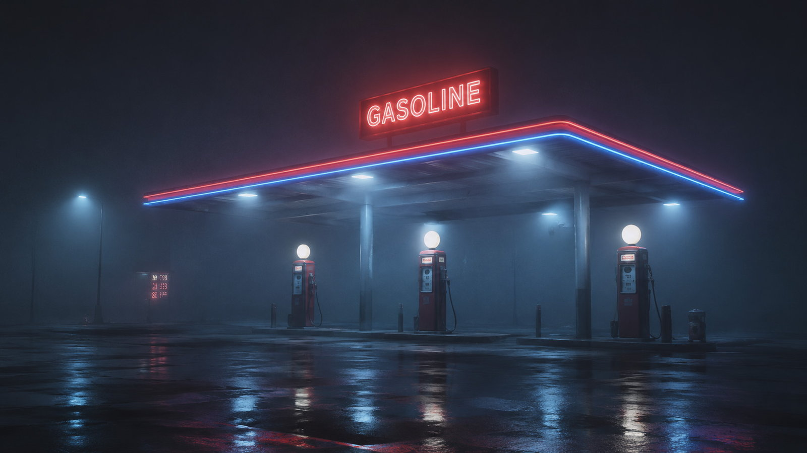
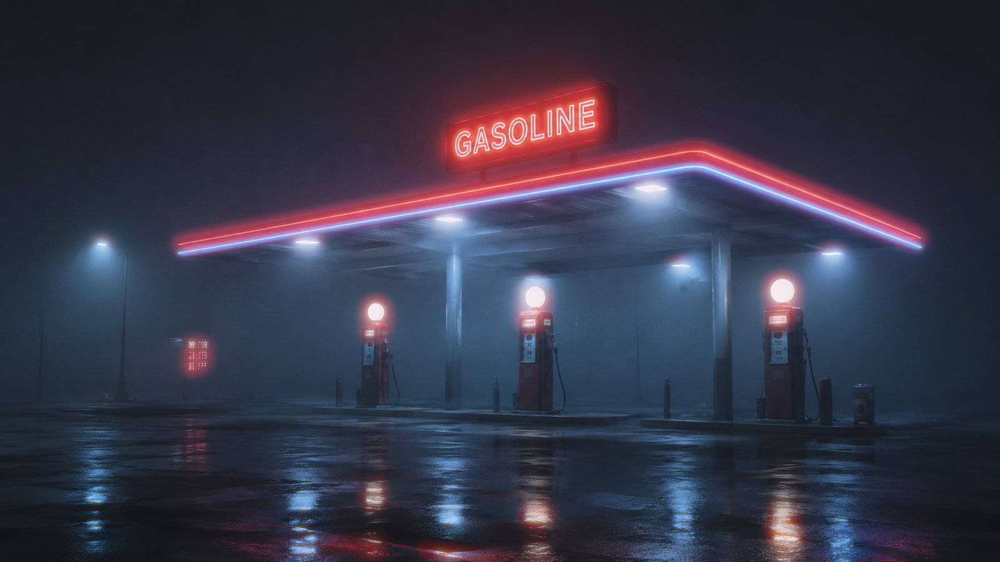
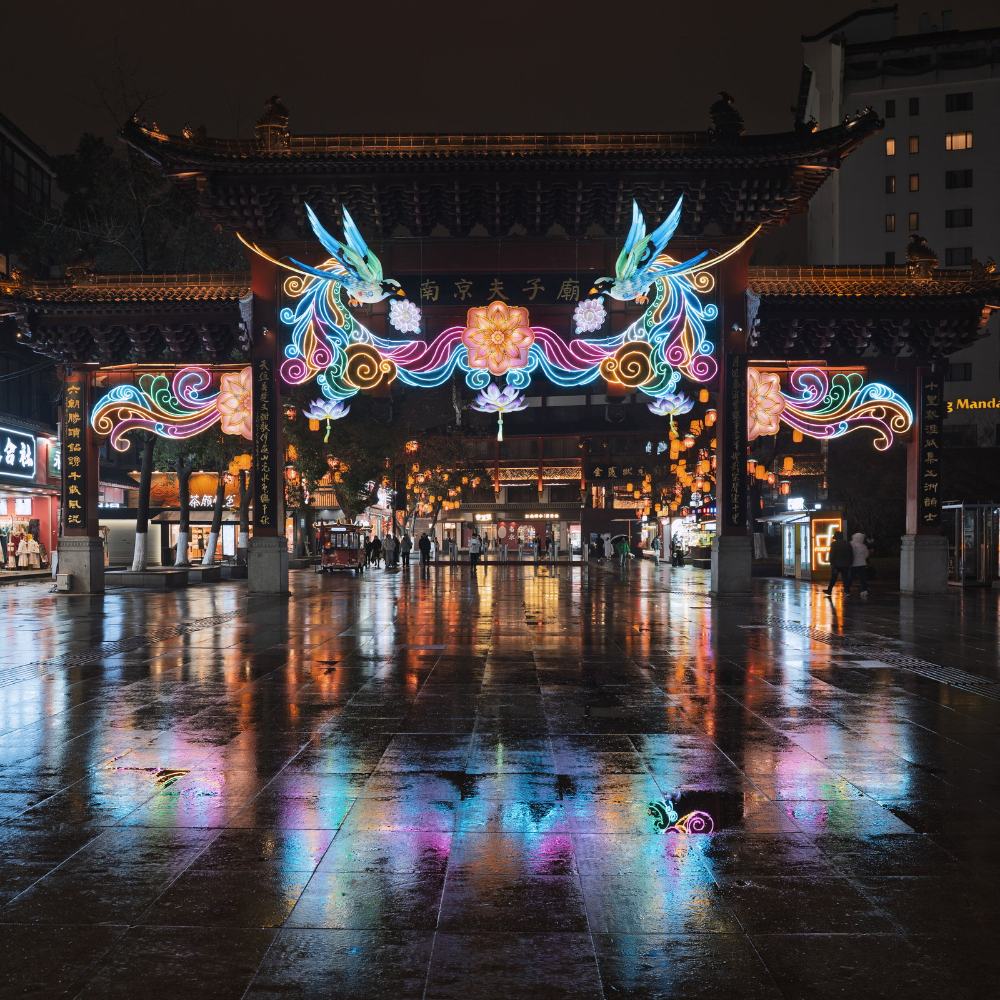
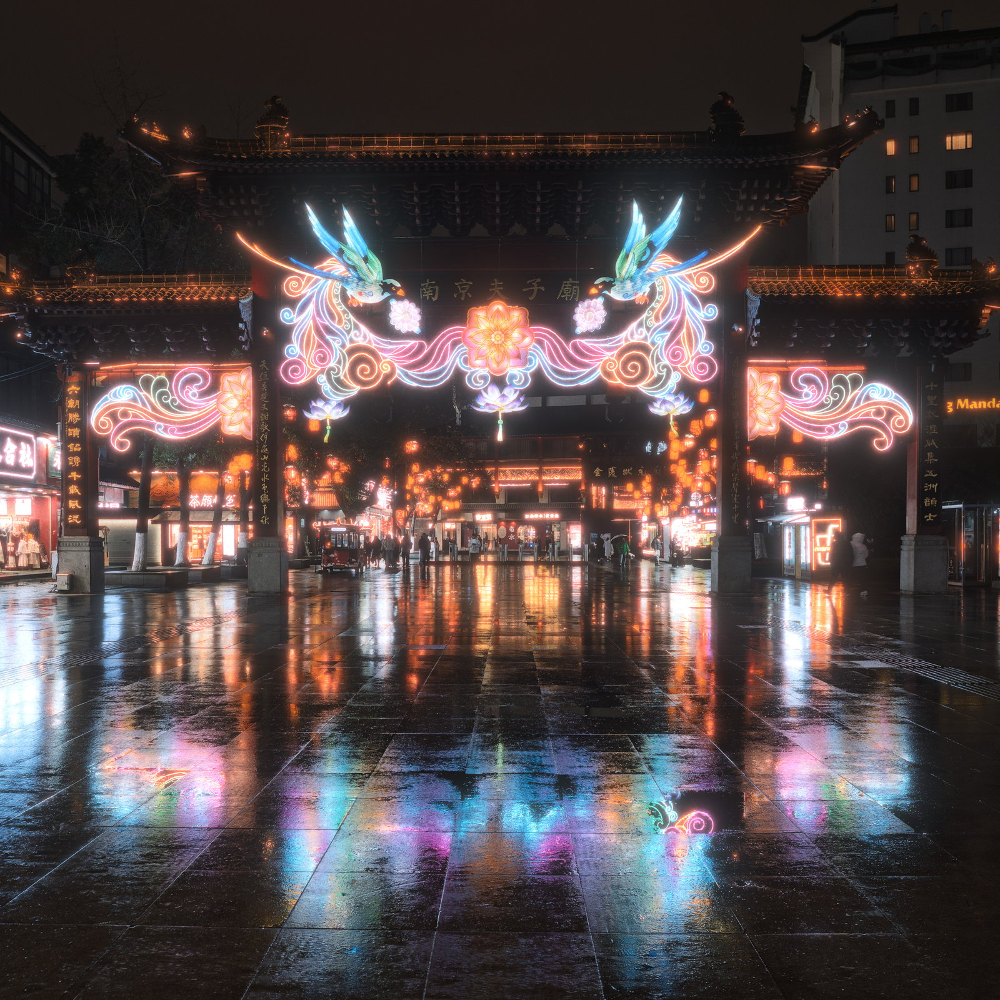
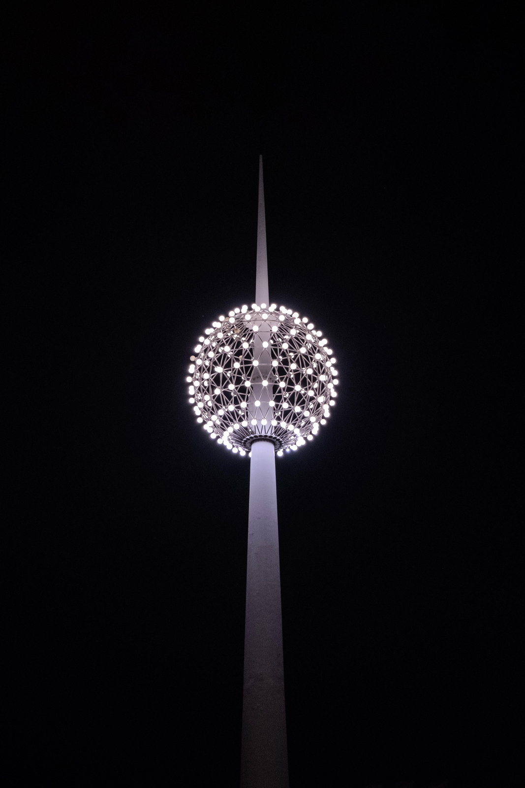
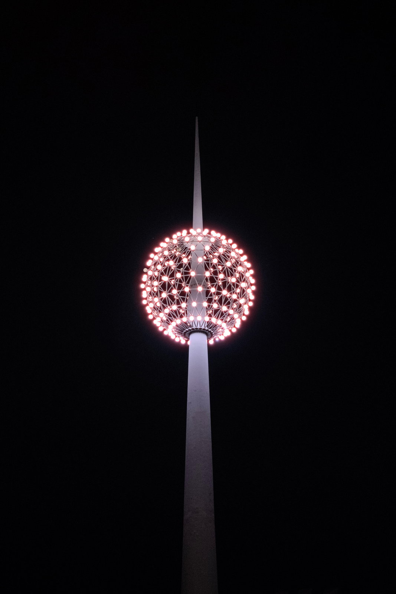
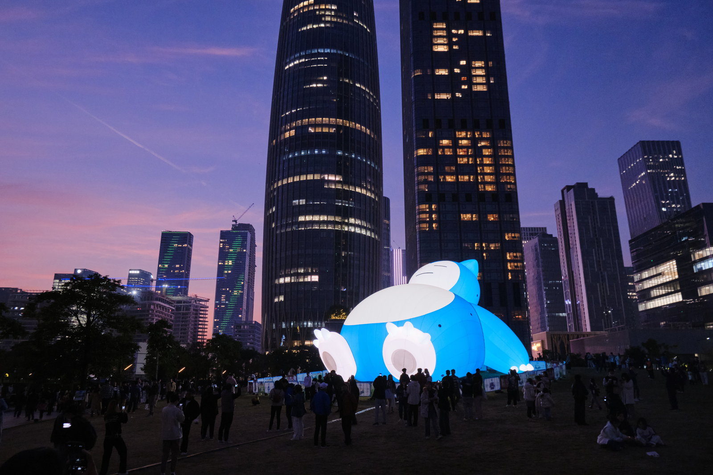
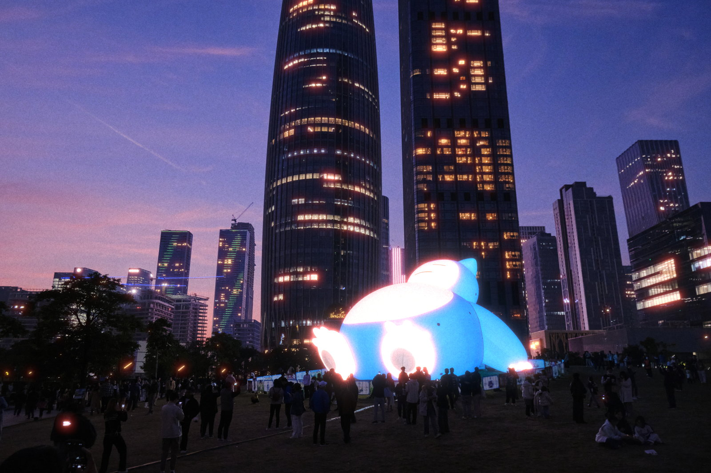

# Film Emulation

**Film Emulation V1.7 Public Beta 1 · Windows 测试版**

Film Emulation 是一款面向 Photoshop 的胶片物理效果插件。它不会套用一张固定滤镜，而是根据画面中的亮度、边缘和曝光关系生成去色边、胶片光晕、泛光、高光保护、胶片解析度变化与曝光相关颗粒。

<a href="media/examples/originals/comparison-film-emulation.jpg"></a>

> 这是第一个公开 Beta。当前支持 Windows 10/11 和 Photoshop 23.3 及以上版本；macOS 尚未完成实机验证。插件界面可随时在中文和 English 之间切换。

[效果对比](#效果对比) · [功能介绍](#它能做什么) · [下载安装](#安装) · [三步上手](#三步上手) · [后续规划](#后续工作展望) · [用户手册](docs/FilmHalation_V1.5.1_User_Manual.md) · [反馈问题](#反馈问题) · [发布说明](RELEASE_NOTES.md)

## 效果对比

下面四张图使用同一底图，展示不同工具的处理取向。它们由项目维护者提供，仅用于直观比较，并不是统一参数、统一目标下的科学测试。点击任意缩略图即可打开对应的原始分辨率版本。

<table>
  <tr>
    <th width="50%">原图</th>
    <th width="50%">Adobe Camera Raw</th>
  </tr>
  <tr>
    <td><a href="media/examples/originals/comparison-original.jpg"></a></td>
    <td><a href="media/examples/originals/comparison-acr.jpg"></a></td>
  </tr>
  <tr>
    <th>Dehancer</th>
    <th>Film Emulation</th>
  </tr>
  <tr>
    <td><a href="media/examples/originals/comparison-dehancer.jpg"></a></td>
    <td><a href="media/examples/originals/comparison-film-emulation.jpg"></a></td>
  </tr>
</table>

从这组示例可以看到本项目在部分场景中的一个优势：面对路灯、顶灯等发散性光源，Film Emulation 能让高光边缘呈现更浓郁、连续的红色胶片光晕；在本示例中，Adobe Camera Raw 与 Dehancer 的对应光源没有呈现出同样明显的红色扩散。这是本项目当前光晕模型希望保留的视觉特征，但不代表在所有照片、参数或工作流下都普遍优于其他工具。事实上，Adobe仍有许多值得本项目学习追赶的地方。

## 更多加工前后示例

<table>
  <tr>
    <th width="50%">处理前</th>
    <th width="50%">Film Emulation</th>
  </tr>
  <tr>
    <td><a href="media/examples/originals/nanjing-before.jpg"></a></td>
    <td><a href="media/examples/originals/nanjing-after.jpg"></a></td>
  </tr>
</table>

<table>
  <tr>
    <th width="50%">处理前</th>
    <th width="50%">Film Emulation</th>
  </tr>
  <tr>
    <td><a href="media/examples/originals/light-before.jpg"></a></td>
    <td><a href="media/examples/originals/light-after.jpg"></a></td>
  </tr>
</table>

<table>
  <tr>
    <th width="50%">处理前</th>
    <th width="50%">Film Emulation</th>
  </tr>
  <tr>
    <td><a href="media/examples/originals/city-before.jpg"></a></td>
    <td><a href="media/examples/originals/city-after.jpg"></a></td>
  </tr>
</table>

实际效果会受到源图曝光、色彩处理、位深和参数影响。示例用于帮助判断视觉方向，不保证每张照片得到相同结果。

## 它能做什么

| 模块                          | 用途                                      |
| --------------------------- | --------------------------------------- |
| 去色边 / Defringe              | 减少高反差边缘常见的紫边和绿边。                        |
| 胶片光晕 / Halation             | 在强光边缘形成由橙红肩部到深红尾部的胶片式光晕，并保护灯芯和大面积白色物体。  |
| 泛光 / Bloom                  | 让高光产生柔和扩散，模拟光在线性图像中的扩散感。                |
| 高光保护 / Highlight Protection | 配合 Bloom 保护灯芯和高亮主体，避免高光结构被扩散淹没。         |
| 胶片解析度 / Film Resolution     | 模拟不同胶片格式、感光度和曝光区域带来的细节与 MTF 响应。         |
| 胶片颗粒 / Film Grain           | 生成随曝光、胶片格式和 ISO 变化，并可通过固定 seed 重现的胶片颗粒。 |

插件只负责这些物理效果，不包含胶片色彩 LUT。建议先在 Adobe Camera Raw 或 Photoshop 中完成 RAW 解码、曝光和色彩调整，再使用 Film Emulation。

## 安装

### 系统要求

- Windows 10 或 Windows 11
- Adobe Photoshop 23.3 或更新版本
- Creative Cloud 桌面应用
- 8、16 或 32 位 RGB 像素图层
- sRGB、Display P3、Adobe RGB 或 ProPhoto RGB 工作空间
- 建议 16GB 或更多内存；大图和完整效果图建议 24–32GB

### 安装步骤

1. 从项目的 [GitHub Releases](https://github.com/PixelCraft2026/film-emulation-plugin/releases) 下载 `FilmEmulation.ccx`。
2. 双击 `.ccx` 文件，Creative Cloud 会打开安装窗口。
3. 第三方安装包可能显示“未经 Adobe 验证”的提示；请确认文件来自本项目 Release 页面，再选择本地安装。
4. 打开或重启 Photoshop，在 `增效工具 / Plugins → Film Emulation` 中打开面板。

Public Beta 1 是第一个公开版本，不需要迁移旧 ID 或导出旧插件状态。更新 Beta 时可直接安装新版；如果 Creative Cloud 拒绝覆盖，请先卸载旧版再安装。

## 三步上手

1. **选择源图层**：在 Photoshop 中选中已经完成曝光和调色的 RGB 像素层。
2. **调整效果**：打开 Film Emulation，可以从 `Neutral / Legacy` 或 `CineStill 800T` 开始，再用 `强度 / Strength`、`半径 Sigma / Sigma` 和 `阈值 / Threshold` 建立整体观感。需要时再打开去色边、泛光、高光保护、胶片解析度和颗粒。
3. **应用到新图层**：确认预览后点击 `应用 / Apply`。插件会创建或更新独立效果层，不会把结果写回源图层。

`CineStill 800T` 是本项目用于描述高强度无 Remjet 视觉方向的实验性预设标签，不是 CineStill 官方预设或对真实胶片库存的精确复刻。

### 预览小提示

- `适合 / Fit` 用于观察整张照片。
- `100%` 用于检查颗粒、细边缘和灯光周围的光晕；可以拖动画面查看其他位置。
- 调整 Threshold 时，向右只保留更亮的光源；移动到最右端会完全排除 Halation 光源，包括 32 位 HDR 高光。
- 中英文切换不会改变当前模块、参数或预览画面。
- 应用内存模式建议保持 `自动（安全）/ Auto (safe)`。只有确认机器内存充足时才使用 High。

完整参数解释见[用户手册](docs/FilmHalation_V1.5.1_User_Manual.md)。

## 非破坏性与隐私

- Preview 只更新插件面板，不会在拖动参数时反复改写 Photoshop 画布。
- Apply 始终从绑定的源像素层重新计算，并写入独立效果层。
- 源图层失效或绑定不明确时，插件会要求重新绑定，不会按名称猜测目标。
- 插件不请求网络权限，也不会上传图像、参数或诊断信息。
- 同一颗粒 seed 在预览、应用和重新打开文档后保持一致。

尽管如此，Beta 期间仍建议保留 PSD/PSB 备份，并在重要项目中先用副本测试。

## 兼容性与已知问题

- 本 Beta 已完成 Windows 实机验收，但仍属于公开测试版本，不等同于正式稳定版。
- macOS 尚未实机验证，本版本不作支持承诺。
- 智能对象、文字、调整层和图层组不能直接作为源；请进入智能对象内容或先栅格化为像素层。
- 32 位 HDR 的面板预览会映射到 SDR 供屏幕显示；Apply 仍按文档的 HDR 浮点数据计算和写回，因此两者在极端高光上的显示观感可能略有差别。
- 24MP、大半径或同时启用完整效果图时，Apply 可能需要数十秒。默认 scalar WASM 后端以宿主稳定性为优先。
- 本插件不模拟胶片色彩响应；示例中的整体色彩可能包含前期 ACR/Photoshop 调整。

已知问题和本版修复记录见[发布说明](RELEASE_NOTES.md)。

## 后续工作展望

Public Beta 1 先把当前六个效果节点、非破坏性处理和 Windows Photoshop 工作流做好。以下方向来自项目技术路线，但版本号不代表发布日期；每项功能都要通过自动测试、视觉样片、内存检查和 Photoshop 实机验证后才会进入公开版本。

- **V1.7.x：继续打磨现有效果和执行引擎。** Halation 会根据 Beta 样片继续校准 HDR 阈值过渡、灯芯保护、强弱光源分离、蓝/青色光源抑制和红色扩散层次，同时维持 Preview 与 Apply 的一致性。底层将继续完善分带、内存预算、取消、失败回退和稳定的 CPU/WASM 执行路径。
- **GPU 加速研究：独立实验，不作为当前版本承诺。** 计划先用独立开发包验证原生 GPU 后端，完整计算 Photoshop 读取、色彩转换、上传、计算、回读和写回的端到端收益。只有结果一致、失败可安全回退，并在目标硬件上获得足够实际提升时才考虑产品化；标准包仍保留 Photoshop 23.3 和 scalar WASM 路径。
- **V1.8：物理暗角与胶片损伤。** 计划加入基于画幅几何的 Vignette，以及可由固定 seed 重现的灰尘、毛发、划痕、污渍和漏光。真实扫描素材只使用项目自有、公共领域或明确授权的内容。
- **V1.9：Overscan 与 Film Gate。** 计划加入扫描边界、片门和片孔等几何效果；需要扩大画布时会创建新文档，保持源文档及其图层不变。
- **V2.0：更完整的 FilmLab 工作流。** 计划提供受约束的节点编辑器、单节点和 Before/After 预览、亮度或 Photoshop 图层蒙版，以及可导入导出的物理效果预设。预设仍不包含 LUT、ICC、ACR profile 或胶片色彩配置，色彩处理继续放在插件之前完成。

路线可能根据 Beta 反馈和宿主能力调整，但不会用降低画质、破坏 HDR/透明度或修改源图层来换取功能数量和速度。

## 卸载

1. 打开 Creative Cloud 桌面应用。
2. 进入 `Stock & Marketplace → Plugins → Manage plugins`。
3. 找到 Film Emulation，点击 `… → Uninstall` 并确认。
4. 重启 Photoshop。

卸载插件不会删除 PSD/PSB 中已经生成的效果像素层。重新安装后如源绑定失效，请选中原始像素层并点击 `重新绑定源图层 / Rebind Source`。

## 反馈问题

请在 GitHub [Issues](https://github.com/PixelCraft2026/film-emulation-plugin/issues) 提交问题。仓库提供了 Beta 反馈模板；如果暂时无法使用模板，请至少附上：

- Photoshop、Windows 和 UXP 版本
- 内存、CPU，以及文档尺寸、位深和色彩空间
- 使用的模块、预设和关键参数
- 可重复的操作步骤
- 插件底栏状态和错误信息截图
- 是否影响 Preview、Apply 或源/效果图层

不要上传含隐私或未获授权的原始照片。可用裁切样片、屏幕录制或合成图代替。

<details>
<summary><strong>从源码构建（面向开发者）</strong></summary>

需要 Node.js、npm 和 Rust `wasm32-unknown-unknown` 工具链。

```powershell
npm ci
npm run build:wasm
npm run typecheck
npm test
npm run validate
npm run build
npm run package
```

最终安装包位于 `dist/FilmEmulation.ccx`。公开包只包含 scalar `film_core.wasm`；`film_core_simd.wasm` 仅用于 Node QA，不进入 CCX。项目使用 JavaScript/ES modules、Rust/WebAssembly 和 Photoshop UXP。

</details>

## 开源许可

本项目采用 **GNU General Public License v3.0 only（GPL-3.0-only）**。你可以依照 GPLv3 使用、研究、修改和再分发本项目；分发修改版或衍生版时，需要遵守 GPLv3 的源代码和同许可证义务。详见 [LICENSE](LICENSE)。

Film Emulation 与其示例效果为独立项目。Adobe、Photoshop、Camera Raw、CineStill 和 Dehancer 是其各自权利人的商标或产品名称；文中提及仅用于兼容性说明、参数命名或视觉比较，不表示官方关联或认可。
